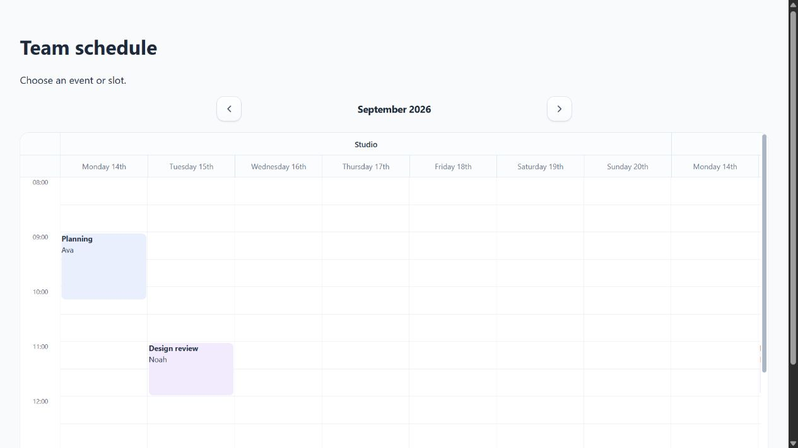

# React calendar integration for Vite and Next.js

ChronoLaneJS is a client-side React and TypeScript calendar and scheduler. The
package works directly in Vite and behind a client boundary in the Next.js App
Router; no framework adapter is required.



## Install the package

Install ChronoLaneJS and its peer dependencies:

```bash
npm install @chronolanejs/react react react-dom date-fns @date-fns/tz
```

## Vite

Import the stylesheet once from the application entry point:

```tsx
// src/main.tsx
import { StrictMode } from "react";
import { createRoot } from "react-dom/client";
import "@chronolanejs/react/styles.css";

import App from "./App";

createRoot(document.getElementById("root")!).render(
    <StrictMode><App /></StrictMode>
);
```

Keep event and navigation state in the application component:

```tsx
// src/App.tsx
import { useState } from "react";
import Calendar from "@chronolanejs/react";
import type { CalendarEvent, CalendarDateInput } from "@chronolanejs/react";

interface Meeting extends CalendarEvent {
    id: string;
}

const initialEvents: Meeting[] = [{
    id: "planning",
    title: "Planning",
    start: "2026-09-14T09:00:00",
    end: "2026-09-14T10:00:00"
}];

export default function App() {
    const [date, setDate] = useState<CalendarDateInput>("2026-09-14");

    return (
        <Calendar<Meeting>
            date={date}
            onDateChange={setDate}
            events={initialEvents}
            view="week"
        />
    );
}
```

The complete runnable consumer is in
[`examples/vite`](../examples/vite/).

## Next.js App Router

Import global package CSS from the server layout:

```tsx
// app/layout.tsx
import "@chronolanejs/react/styles.css";

export default function RootLayout({ children }: { children: React.ReactNode }) {
    return <html lang="en"><body>{children}</body></html>;
}
```

Keep the interactive calendar and its state in a client component:

```tsx
// app/Schedule.tsx
"use client";

import { useState } from "react";
import Calendar from "@chronolanejs/react";
import type { CalendarDateInput } from "@chronolanejs/react";

export default function Schedule() {
    const [date, setDate] = useState<CalendarDateInput>("2026-09-14");

    return (
        <Calendar
            date={date}
            onDateChange={setDate}
            events={[]}
            view="week"
        />
    );
}
```

```tsx
// app/page.tsx
import Schedule from "./Schedule";

export default function Page() {
    return <main><Schedule /></main>;
}
```

The package entry includes `"use client"`, allowing Next.js to recognize the
boundary. The application still owns state, callbacks, persistence, and any
server communication. The complete runnable consumer is in
[`examples/next`](../examples/next/).

## Verify a consumer build

From a repository checkout:

```bash
npm run build
npm run examples:check
```

The verification script packs one package artifact, installs it into temporary
clean copies of both consumers, type-checks them, and production-builds them.

Continue with [Resource scheduling](./resources.md),
[Drag and resize events](./interactions.md), or
[Custom renderers](./renderers.md) after the framework boundary is working.
