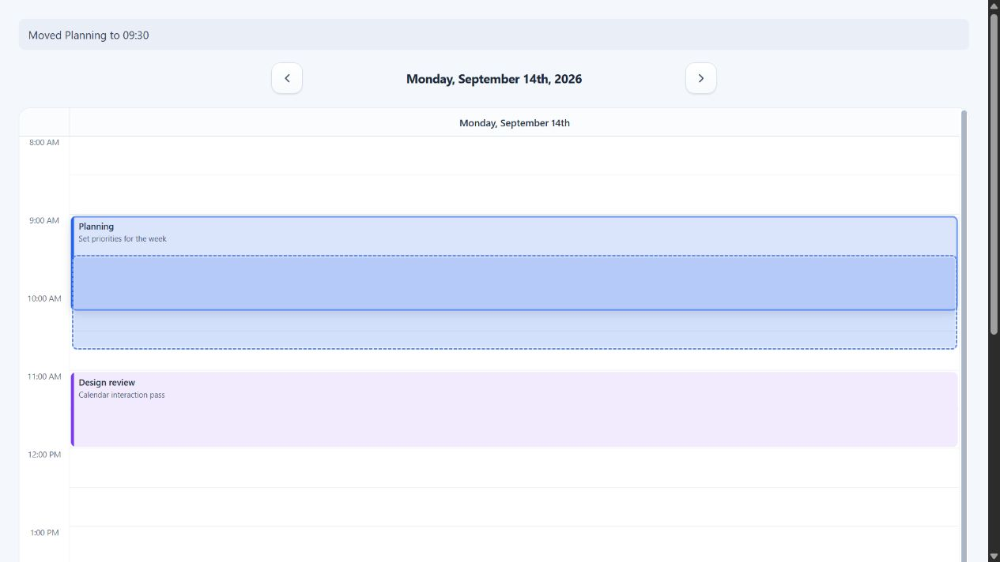
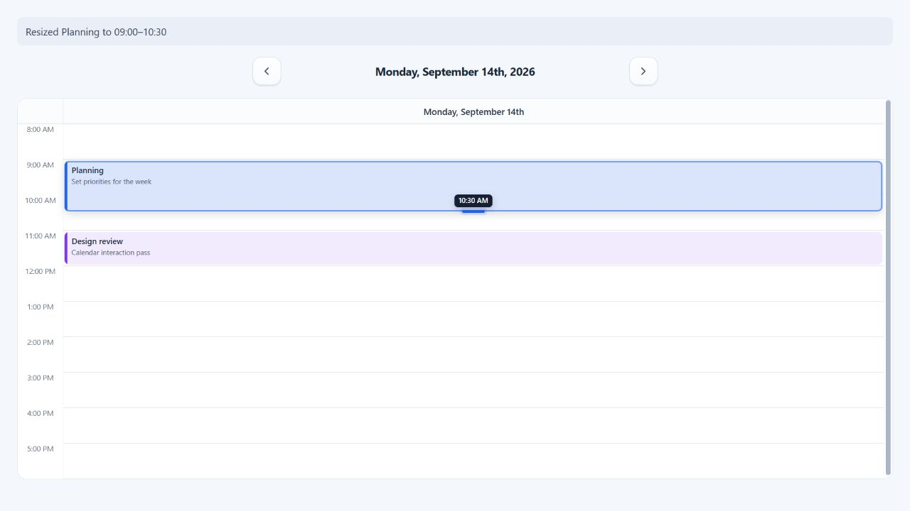

# Drag and resize events

ChronoLaneJS enables event movement and resizing when a time-grid view receives
`onEventDrop` or `onEventResize`. Pointer, touch, and keyboard input share the
same proposal callbacks; the library never mutates application events.



## Controlled event updates

Keep the source events in application state and apply each committed proposal.
The callback includes the complete source event, full proposed interval, and
source or destination resource position.

```tsx
import { useState } from "react";
import Calendar from "@chronolanejs/react";
import type {
    CalendarEvent,
    TimeGridEventDrop,
    TimeGridEventResize
} from "@chronolanejs/react";
import "@chronolanejs/react/styles.css";

interface Meeting extends CalendarEvent {
    id: string;
    locked?: boolean;
    resourceId?: string;
}

const initialEvents: Meeting[] = [{
    id: "planning",
    title: "Planning",
    start: "2026-09-14T09:00:00",
    end: "2026-09-14T10:15:00"
}];

export default function EditableSchedule() {
    const [events, setEvents] = useState(initialEvents);

    const moveEvent = ({
        event,
        start,
        end,
        destination
    }: TimeGridEventDrop<Meeting>) => {
        setEvents((current) => current.map((item) => item.id === event.id
            ? {
                ...item,
                start,
                end,
                resourceId: destination.resourceId == null
                    ? undefined
                    : String(destination.resourceId)
            }
            : item));
    };

    const resizeEvent = ({
        event,
        start,
        end
    }: TimeGridEventResize<Meeting>) => {
        setEvents((current) => current.map((item) => item.id === event.id
            ? { ...item, start, end }
            : item));
    };

    return (
        <Calendar<Meeting>
            date="2026-09-14"
            events={events}
            view="week"
            viewProps={{
                minTime: "08:00",
                maxTime: "18:00",
                slotDuration: 30,
                resizeStep: 15,
                canDragEvent: (event) => !event.locked,
                canResizeEvent: (event) => !event.locked,
                onEventDrop: moveEvent,
                onEventResize: resizeEvent
            }}
        />
    );
}
```

Persist, validate, reject, or optimistically apply a proposal in these
callbacks. Until the application updates `events`, the source event remains
unchanged.

## Movement input

| Input | Start | Choose a target | Commit or cancel |
| --- | --- | --- | --- |
| Pointer | Drag the event body past the movement threshold. | Move over a visible slot or resource column. | Release to commit; pointer cancellation discards. |
| Touch | Drag the event body. | Move over a visible slot or resource column. | Release to commit; touch cancellation discards. |
| Keyboard | Focus the event. | Arrow Up/Down changes time; Left/Right changes the visible day or resource. | Enter or blur commits; Escape cancels. |

Movement preserves the complete event duration, including when the visible
segment is clipped by the current range. `destination` identifies the proposed
day and resource independently of the event's original assignment.

## Resize input

Supplying `onEventResize` exposes start and end edge controls. `resizeStep`
sets the pointer, touch, and keyboard increment independently from
`slotDuration`.



Focused resize handles use Arrow Up/Down for timed events. Dedicated multi-day
events use Left/Right and whole calendar-day steps. Enter or blur commits one
proposal; Escape restores the source interval. The callback's `edge` is
`"start"` or `"end"`.

## Multi-day events and permissions

Set `multiDayEventLayout="dedicated"` to move and resize multi-day events in a
separate region above the timed grid. Day steps preserve wall-clock fields
across daylight-saving transitions.

`canDragEvent(event, segment)` and `canResizeEvent(event, segment, edge)` run
for each rendered occurrence. Use `segment.day`, `segment.resource`, and
`segment.resourceId` for occurrence-specific permissions. Background events
never expose movement or resize controls.

See [Accessibility](./accessibility.md#event-movement-behavior) for the complete
keyboard contract, [Calendar and views](./api/calendar-and-views.md#dayview-weekview-and-timegridview)
for callback props, and [Interactions and callbacks](./api/interactions-callbacks.md)
for their payloads.
