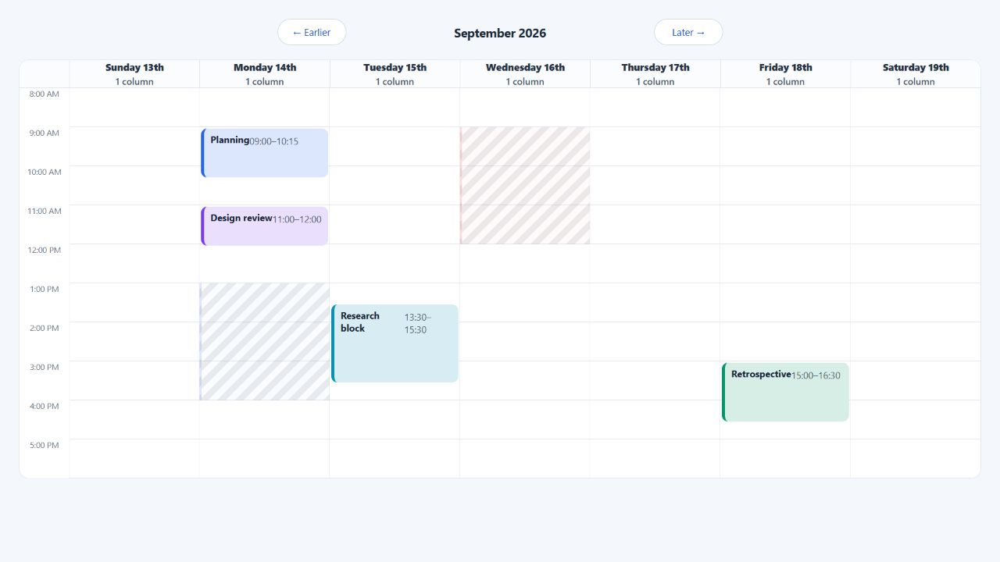

# Custom renderers

ChronoLaneJS exposes typed renderer boundaries for application-owned markup
without transferring calendar geometry or interaction state. Replace the
smallest boundary that needs different presentation and preserve the supplied
root attributes.



## Complete event renderer

The event renderer receives the normalized source event, its visible segment,
selection state, and `elementProps`. Spread `elementProps` onto the root before
adding application classes or attributes.

```tsx
import Calendar from "@chronolanejs/react";
import type {
    CalendarEvent,
    TimeGridEventProps
} from "@chronolanejs/react";
import "@chronolanejs/react/styles.css";

interface Meeting extends CalendarEvent {
    id: string;
    owner: string;
    status: "confirmed" | "tentative";
}

function MeetingEvent({
    event,
    segment,
    selected,
    elementProps
}: TimeGridEventProps<Meeting>) {
    return (
        <div
            {...elementProps}
            className={`${elementProps.className} meeting-event`}
            data-layout={segment.layout}
            data-selected={selected || undefined}
            data-status={event.status}
        >
            <strong>{event.title}</strong>
            <span>{event.owner}</span>
        </div>
    );
}

const events: Meeting[] = [{
    id: "review",
    title: "Design review",
    owner: "Noah",
    status: "confirmed",
    start: "2026-09-14T11:00:00",
    end: "2026-09-14T12:00:00"
}];

export default function ProductCalendar() {
    return (
        <Calendar<Meeting>
            date="2026-09-14"
            events={events}
            view="week"
            viewProps={{ components: { event: MeetingEvent } }}
        />
    );
}
```

```css
.meeting-event {
    display: grid;
    align-content: start;
    gap: 2px;
    padding: 6px 8px;
    border-left: 4px solid #2563eb;
    background: #dbeafe;
    color: #172033;
}

.meeting-event[data-status="tentative"] {
    border-left-style: dashed;
}
```

## Renderer boundaries

| Surface | Available renderers |
| --- | --- |
| Time grid, day, and week | `event`, `slot`, `backgroundEvent`, `dayHeader`, `resourceHeader`, `navigation` |
| Month | `event`, `dayHeader`, `navigation` |
| Agenda | `event`, `dayHeader`, `empty`, `navigation` |
| Root `Calendar` | `navigation` shared by built-in views |

Time-grid `event` receives source identity in `event` and clipped day/resource
context in `segment`. Month and agenda events receive their occurrence context.
Header renderers receive concrete day or resource values and covered columns.

## Preserve the root contract

`elementProps` owns required positioning, styles, classes, accessible names,
focus, pointer handlers, keyboard handlers, and drag behavior. Dropping or
moving those attributes can make an event look correct while breaking layout
or input support.

Keep these rules:

1. Spread `elementProps` on the renderer's root.
2. Append to `elementProps.className`; do not replace it.
3. Preserve `elementProps.style` when adding inline styles.
4. Keep the supplied accessible name unless the replacement is equivalent or
   more specific.
5. Do not introduce nested focus targets without an explicit focus and event
   propagation policy.
6. Keep a slot renderer's root as its only focus target.

Use [Styling and theming](./styling.md) when markup can remain unchanged. Review
[Accessibility](./accessibility.md#custom-renderer-responsibilities) before
shipping any renderer replacement, and use the
[renderer API](./api.md#renderer-contracts) for exact payload types.
