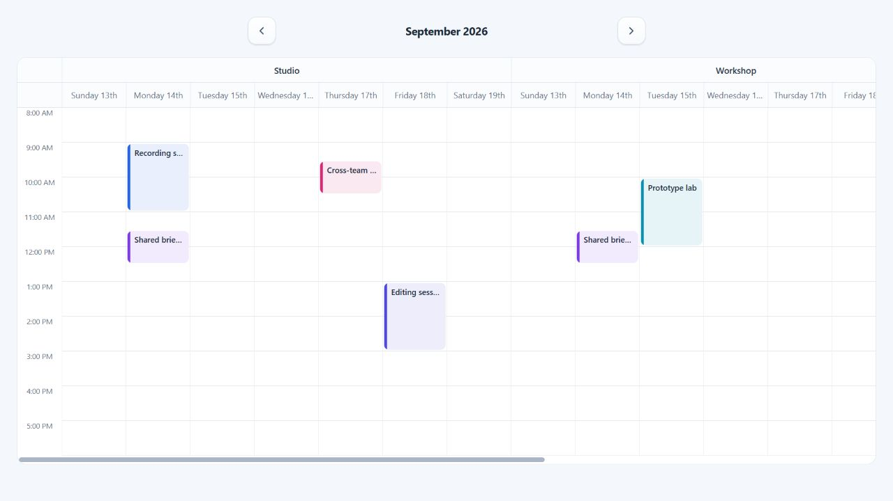

# Resource scheduling

ChronoLaneJS can subdivide every visible time-grid day into typed resources.
A resource can represent a room, person, machine, vehicle, or any other value
with a stable string or numeric ID.



## Complete resource calendar

Define the resource shape and event assignment together so TypeScript carries
both through columns, callbacks, and renderers.

```tsx
import { useState } from "react";
import Calendar from "@chronolanejs/react";
import type {
    CalendarEvent,
    CalendarResourceConfig,
    TimeGridEventDrop
} from "@chronolanejs/react";
import "@chronolanejs/react/styles.css";

interface Room {
    id: string;
    name: string;
    floor: number;
}

interface Meeting extends CalendarEvent {
    id: string;
    roomIds: string[];
}

const rooms: Room[] = [
    { id: "studio", name: "Studio", floor: 1 },
    { id: "workshop", name: "Workshop", floor: 2 }
];

const resources: CalendarResourceConfig<Meeting, Room> = {
    items: rooms,
    getId: (room) => room.id,
    getTitle: (room) => `${room.name} - floor ${room.floor}`,
    getEventIds: (event) => event.roomIds
};

const initialEvents: Meeting[] = [{
    id: "review",
    title: "Design review",
    start: "2026-09-14T10:00:00",
    end: "2026-09-14T11:00:00",
    roomIds: ["studio"]
}];

export default function RoomSchedule() {
    const [events, setEvents] = useState(initialEvents);

    const moveMeeting = ({
        event,
        start,
        end,
        destination
    }: TimeGridEventDrop<Meeting, Room>) => {
        setEvents((current) => current.map((item) => item.id === event.id
            ? {
                ...item,
                start,
                end,
                roomIds: destination.resource ? [destination.resource.id] : []
            }
            : item));
    };

    return (
        <Calendar<Meeting, Room>
            date="2026-09-14"
            events={events}
            view="week"
            viewProps={{
                resources,
                groupBy: "resource",
                minTime: "08:00",
                maxTime: "18:00",
                slotSizing: { minWidth: 96 },
                onEventDrop: moveMeeting
            }}
        />
    );
}
```

## Assignment conventions

Without accessors, ChronoLaneJS reads `resource.id`, chooses a title from
`resource.title`, `resource.name`, or `resource.id`, and reads event assignments
from `resourceIds`, `resourceId`, or `resource.id`. Use accessors for another
domain shape.

An event assigned to multiple IDs is rendered once in each matching column.
Unassigned events do not appear when resource columns are active. Resource IDs
are non-empty strings or finite numbers. Invalid IDs and duplicate resource
definitions throw explicit errors; a valid assignment with no matching column
is ignored.

## Grouping and sizing

`groupBy="day"` renders each day as the outer heading with its resources below.
`groupBy="resource"` renders each resource as the outer heading with its days
below. The underlying day-resource columns and assignments are identical.

Use `slotSizing.width` for fixed columns or `slotSizing.minWidth` for fluid
columns that scroll after reaching a minimum. Headers and slots share the same
track definition, so grouped headings stay aligned during horizontal scroll.

## Resource-aware extensions

The concrete resource and stable ID are available on:

- `TimeGridColumn`, `TimeGridSlot`, and `TimeGridEventSegment`;
- movement `source` and `destination` positions;
- event occurrence context for selection, opening, and raw interactions;
- custom resource-header, event, slot, and background-event renderers.

See [Drag and resize events](./interactions.md) for controlled movement between
resources and [Custom renderers](./renderers.md) for typed resource headers.
