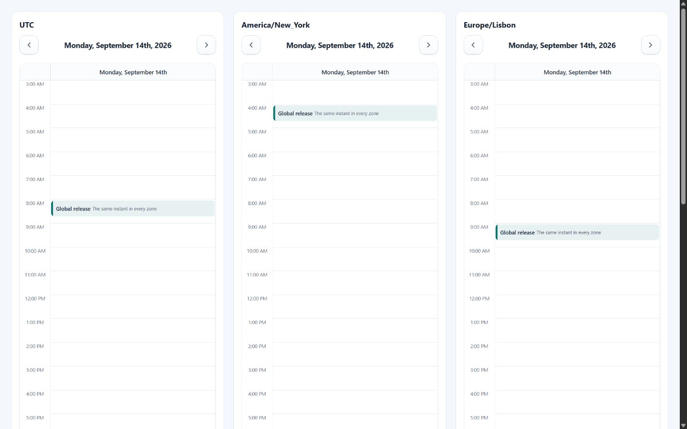

# Time zones and localization

ChronoLaneJS uses IANA time zones for calendar arithmetic and date-fns locales
for labels, week boundaries, and 12- or 24-hour clocks. The important modeling
choice is whether an input represents a wall-clock value or an absolute
timestamp.



## Wall-clock values

Calendar strings and ordinary `Date` values preserve their visible fields when
`timeZone` is attached. A meeting stored as `2026-09-14T09:00:00` therefore
stays at 09:00 in Lisbon, New York, or Tokyo. Use this for schedules whose local
wall time is authoritative.

```tsx
<Calendar
    date="2026-09-14"
    events={[{
        id: "standup",
        title: "Local stand-up",
        start: "2026-09-14T09:00:00",
        end: "2026-09-14T09:30:00"
    }]}
    timeZone="Europe/Lisbon"
/>
```

`asCalendarDate` and `toCalendarTimeZone` use this wall-clock behavior.

## Absolute timestamps

For an instant shared across locations, convert its timestamp into the target
zone with `calendarDateFromTimestamp`. The calendar then receives a zoned value
whose visible fields are already correct.

```tsx
import Calendar, { calendarDateFromTimestamp } from "@chronolanejs/react";

const releaseStart = Date.parse("2026-09-14T08:00:00Z");
const releaseEnd = Date.parse("2026-09-14T08:45:00Z");

export default function ZonedRelease({ timeZone }: { timeZone: string }) {
    const events = [{
        id: "release",
        title: "Global release",
        start: calendarDateFromTimestamp(releaseStart, timeZone),
        end: calendarDateFromTimestamp(releaseEnd, timeZone)
    }];

    return (
        <Calendar
            date={calendarDateFromTimestamp(releaseStart, timeZone)}
            events={events}
            timeZone={timeZone}
            view="day"
            viewProps={{ minTime: "03:00", maxTime: "18:00" }}
        />
    );
}
```

The example renders at 08:00 in UTC, 04:00 in New York, 09:00 in Lisbon, and
17:00 in Tokyo on that date.

## Locale loading

Pass a date-fns locale name or a locale object. Named locales are loaded lazily;
preload the known application locale before rendering or provide
`localeFallback` while React Suspense resolves it.

```tsx
import Calendar, {
    defaultCalendarMessages,
    preloadCalendarLocale
} from "@chronolanejs/react";

void preloadCalendarLocale("pt-PT");

const messages = {
    ...defaultCalendarMessages,
    previous: () => "Período anterior",
    next: () => "Período seguinte"
};

<Calendar
    locale="pt-PT"
    localeFallback={<p role="status">Loading calendar...</p>}
    messages={messages}
    timeZone="Europe/Lisbon"
/>
```

Locale conventions determine the default first weekday and formatter output.
Set `weekStart` when product rules must override the locale.

## Daylight-saving transitions

Time-grid rows represent wall-clock labels. Spring and fall transitions retain
the configured row sequence, while event dates and interaction proposals use
the selected zone's offsets. Multi-day movement and resizing preserve
wall-clock fields when stepping across a transition.

Test application-specific schedules in every supported zone, including both
DST boundaries and fractional offsets. The Storybook locale/time-zone toolbar
and daylight-saving story provide deterministic inspection surfaces.

See [Localization and utilities](./api/localization-utilities.md#date-functions)
for date helper contracts and
[Accessibility](./accessibility.md) for localized accessible-name requirements.
